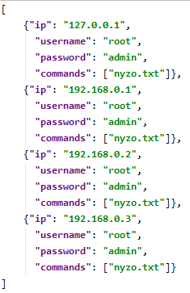

# sshauto
Automate repetitive and tideous SSH tasks, send bulk commands to multiple terminals without having to log in to them individually.

**Initial setup**

Create your configuration file from the `demo.json` template and adjust settings.

If you don't want to store plaintext passwords, enter `"ask"` as your password to be asked during the procedure. If you want to use one password for all servers, enter `"askonce"` instead. The script sorts servers from top to bottom, so you can organize around `"askonce"` and still have passwords and `"ask"` trigger ahead of it. 

For linux, you need to `apt-get install plink`. For Windows, you need the bundled `plink.exe`

**This is what a demo config file looks like:**

```
[
  {
    "ip": "192.168.0.1",
    "username": "root",
    "password": "admin",
    "scripts": ["scripts/nyzo_update.txt"]
  },
  {
    "ip": "192.168.0.2",
    "username": "root",
    "password": "ask",
    "scripts": ["scripts/nyzo_update.txt"]
  },
  {
    "ip": "192.168.0.3",
    "username": "root",
    "password": "askonce",
    "scripts": ["scripts/nyzo_update.txt", "bismuth_balance.txt"]
  },
  {
    "ip": "192.168.0.4",
    "username": "root",
    "password": "",
    "scripts": ["scripts/nyzo_update.txt"]
  }
]
```
Supports unlimited number of servers and unlimited number of script files per server. Of course, you may have as many configurations as you want since execution happens through arguments.


**The script file is simply a set of commands you would normally enter in terminal:**

```
cd nyzoVerifier
git fetch --all
git reset --hard origin/master
git pull origin master
./gradlew build
sudo supervisorctl reload
```

To run, you need to supply your configuration file as an argument to the script, here's the demo example:
```
python3.7 sshauto.py --conf configs/demo.json
```

**Visualisation**


