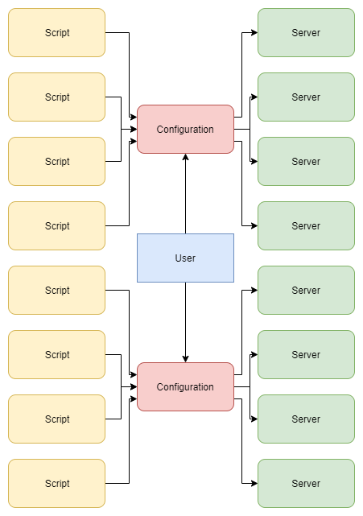

# sshauto
Automate repetitive and tideous SSH tasks, send bulk commands to multiple terminals without having to log in to them individually.

Create `secret.json` from `secret_demo.json` and adjust settings.
If you don't want to store plaintext passwords, enter `"ask"` as your password to be asked during the procedure. If you want to use one password for all servers, enter `"askonce"` instead. The script sorts servers from top to bottom, so you can organize around `"askonce"` and still have passwords and `"ask"` trigger ahead of it.

For linux, you need to `apt-get install plink`. For windows, you need the bundled `plink.exe`

To run, `python3.7 sshauto.py` or `python3 sshauto.py` or `python sshauto.py`, depending on your local configuration. In Windows, you run `sshauto.py` in your favorite IDE or the command line Python.

Supports unlimited number of servers and unlimited number of command files per server, as in `["nyzo.txt", "bismuth.txt"]`.

